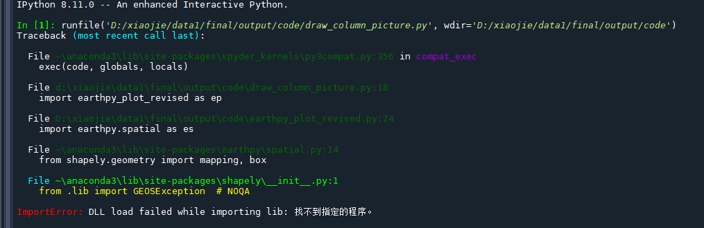
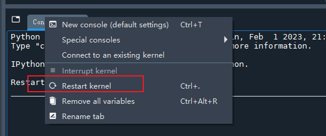
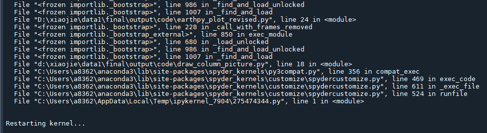
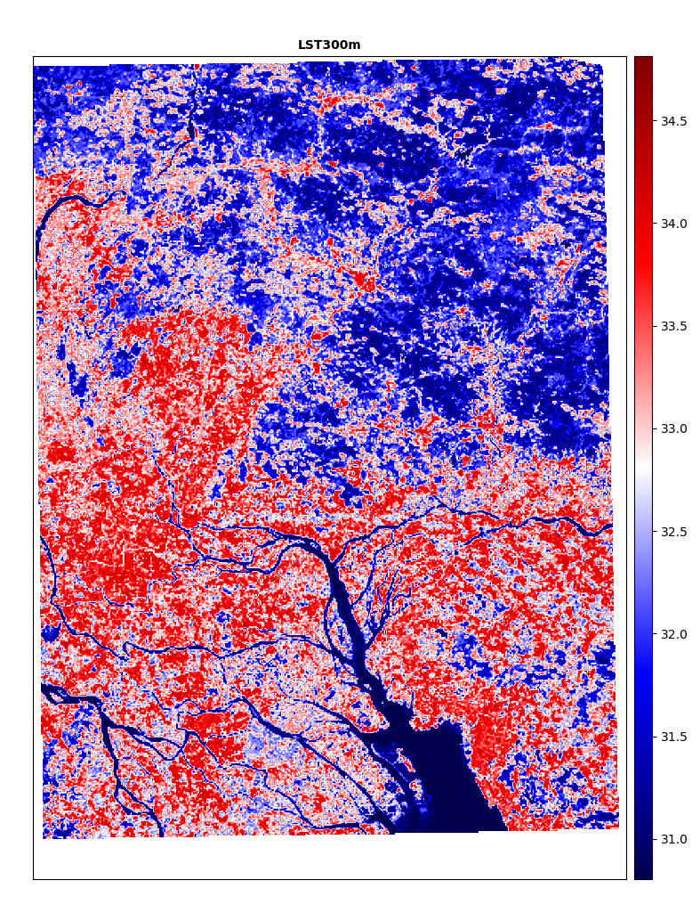
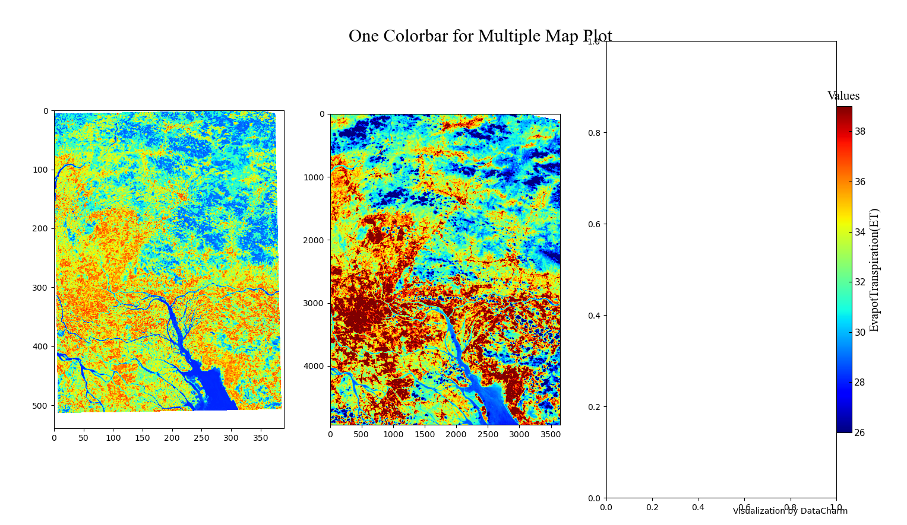

# 代码结构

DEM_LAI_SMCI_1km.py   ->师兄给的代码

绘制单图.py   ->依赖    earthpy_plot_revised.py


# 程序报错



解决方案：

- restart kernel






一定要注意导包的顺序：

```python
import cartopy.crs as ccrs
from cartopy.io.shapereader import Reader
```

```python
from osgeo import gdal
```


# 用matplotlib的imshow显示图像，设置colorbar的颜色范围

[(85条消息) 用matplotlib的imshow显示图像，设置colorbar的颜色范围_colorbar颜色范围自定义_whoispo的博客-CSDN博客](https://blog.csdn.net/WhoisPo/article/details/104532250)


# colorbar调整

300m降尺度结果






